<div align="center">


<p align="center">
  
</p>

[](https://github.com/jainilgupta02/DevOps-Portfolio/stargazers)
[](https://github.com/jainilgupta02/DevOps-Portfolio/network)
[](https://github.com/jainilgupta02/DevOps-Portfolio/commits)
[](LICENSE)


</div>

---

## 🎯 About This Repository


Welcome to my **Master DevOps Portfolio** — a comprehensive collection of hands-on projects, labs, and real-world implementations created during my **PW Skills DevOps & Cloud Computing Professional Certificate Program**.

This repository serves as a **centralized hub** linking all my DevOps journey milestones:

- 🐧 **Linux System Administration & Scripting**
- 🔧 **Version Control & Collaboration**
- 🔄 **CI/CD Pipeline Automation**
- 🐳 **Containerization & Orchestration**
- ☁️ **Cloud Infrastructure Management**
- 📊 **Monitoring & Observability**
- 🏗️ **Infrastructure as Code**
- 🔐 **DevSecOps Practices**

<br>

> **Note:** This is a living repository that evolves continuously as I progress through the program and build more production-grade systems.

<br clear="right"/>

---

## 📚 Program Context

<div align="center">
  
</div>

### **PW Skills - DevOps & Cloud Computing Professional Program**

<table>
<tr>
<td width="50%">

**📋 Program Details**
- ⏱️ Duration: 6 months
- 💻 Tech Hours: 150+
- 🎯 Projects: 20+ guided labs
- 📅 Mode: Live weekend sessions
- 🎓 Certification: PW Skills & PwC India

</td>
<td width="50%">

**🎯 Learning Approach**
- Live instructor-led sessions
- Real-time project demonstrations
- Production-level deployments
- Capstone integration project
- Dedicated peer community

</td>
</tr>
</table>

---

## 🧠 Skills & Technologies

<div align="center">

### Core DevOps Stack


<br><br>

| Skill Domain | Tools & Technologies |
|-------------|---------------------|
| **🐧 Linux & Scripting** | Bash, Shell Scripting, Cron, Process Management |
| **🔧 Version Control** | Git, GitHub, GitLab, Branching Strategies |
| **🔄 CI/CD** | GitHub Actions, Jenkins, GitLab CI, Spinnaker |
| **🐳 Containers** | Docker, Docker Compose, Container Networking |
| **☸️ Orchestration** | Kubernetes, Helm, StatefulSets, RBAC |
| **☁️ Cloud Platforms** | AWS (EC2, S3, VPC, IAM, Lambda) |
| **🏗️ Infrastructure as Code** | Terraform, CloudFormation, Ansible |
| **📊 Monitoring** | Prometheus, Grafana, ELK Stack |
| **🔐 Security** | DevSecOps, Vault, Security Policies |
| **🐍 Programming** | Python, YAML, JSON |

</div>

---

## 📁 Repository Structure

```
DevOps-Portfolio/
│
├── 📂 projects/
│   ├── 01-ci-cd-practice/          # GitHub Actions CI/CD Pipeline
│   ├── 02-ci-cd-advanced/          # Jenkins + Pytest + Artifacts
│   ├── 03-python-api-devops/       # Flask API with CI/CD
│   ├── 04-docker-microservices/    # Multi-container Applications
│   ├── 05-kubernetes-deployment/   # K8s Orchestration & Scaling
│   ├── 06-terraform-aws/           # Infrastructure Automation
│   ├── 07-ansible-config/          # Configuration Management
│   ├── 08-monitoring-stack/        # Prometheus + Grafana Setup
│   └── 09-capstone-project/        # Final Integration Project
│
├── 📂 labs/
│   ├── linux-administration/       # System admin exercises
│   ├── bash-automation/            # Shell scripting labs
│   └── networking-security/        # Network & firewall configs
│
├── 📂 notes/
│   ├── week-01-to-04-linux.md
│   ├── week-05-to-08-git-bash.md
│   ├── week-09-to-13-python.md
│   ├── week-14-to-18-cicd.md
│   └── week-19-onwards-cloud.md
│
└── 📂 resources/
    ├── cheatsheets/
    ├── documentation/
    └── references/
```

---

## 🚀 Featured Projects

<div align="center">
  
</div>

### 🔹 Phase 1: CI/CD Foundations

| Project | Description | Tech Stack | Status |
|---------|-------------|------------|--------|
| **[CI/CD Practice](https://github.com/jainilgupta02/ci-cd-practice)** | Automated GitHub Actions pipeline with multi-stage deployment | GitHub Actions, Python, YAML | ✅ Complete |
| **[Advanced CI/CD](https://github.com/jainilgupta02/ci-cd-2)** | Jenkins pipeline with pytest, artifacts, and deployment simulation | Jenkins, Pytest, Python | ✅ Complete |
| **[Python API DevOps](https://github.com/jainilgupta02/pd-np-api)** | Flask REST API with automated testing and CI/CD integration | Flask, Pytest, GitHub Actions | ✅ Complete |

### 🔹 Phase 2: Containerization & Orchestration

| Project | Description | Tech Stack | Status |
|---------|-------------|------------|--------|
| **Docker Microservices** | Multi-container web application with Docker Compose | Docker, Compose, Nginx | 🟡 In Progress |
| **Kubernetes Deployment** | Rolling updates, autoscaling, and service mesh | Kubernetes, Helm, YAML | ⏳ Upcoming |

### 🔹 Phase 3: Cloud & Infrastructure

| Project | Description | Tech Stack | Status |
|---------|-------------|------------|--------|
| **AWS Infrastructure (Terraform)** | Automated AWS resource provisioning | Terraform, AWS, HCL | ⏳ Upcoming |
| **Ansible Configuration** | Multi-server configuration management | Ansible, YAML, Jinja2 | ⏳ Upcoming |
| **Monitoring Stack** | Full observability with metrics and alerts | Prometheus, Grafana | ⏳ Upcoming |

### 🔹 Capstone Project

| Project | Description | Tech Stack | Status |
|---------|-------------|------------|--------|
| **End-to-End DevOps Platform** | Complete CI/CD + containerization + cloud automation | All tools combined | ⏳ Upcoming |

---

## 📈 Learning Roadmap

```mermaid
graph LR
    A[Linux Fundamentals] --> B[Git & Version Control]
    B --> C[Bash Scripting]
    C --> D[Python Automation]
    D --> E[CI/CD Pipelines]
    E --> F[Docker Containers]
    F --> G[Kubernetes]
    G --> H[Cloud - AWS]
    H --> I[Terraform IaC]
    I --> J[Ansible Config]
    J --> K[Monitoring]
    K --> L[Capstone Project]
    
    style A fill:#667eea,stroke:#333,stroke-width:2px,color:#fff
    style E fill:#764ba2,stroke:#333,stroke-width:2px,color:#fff
    style L fill:#f093fb,stroke:#333,stroke-width:2px,color:#fff
```

<div align="center">



</div>

<table align="center">
<tr>
<th>Phase</th>
<th>Topics Covered</th>
<th>Duration</th>
<th>Status</th>
</tr>
<tr>
<td>🟢 Phase 1</td>
<td>Linux + Git + Bash</td>
<td>Weeks 1-8</td>
<td>✅ Complete</td>
</tr>
<tr>
<td>🟡 Phase 2</td>
<td>Python + CI/CD</td>
<td>Weeks 9-18</td>
<td>🔄 In Progress</td>
</tr>
<tr>
<td>⚪ Phase 3</td>
<td>Docker + Kubernetes</td>
<td>Weeks 19-24</td>
<td>⏳ Upcoming</td>
</tr>
<tr>
<td>⚪ Phase 4</td>
<td>Cloud (AWS) + Terraform</td>
<td>Weeks 25-30</td>
<td>⏳ Upcoming</td>
</tr>
<tr>
<td>⚪ Phase 5</td>
<td>Monitoring + Security</td>
<td>Weeks 31-36</td>
<td>⏳ Upcoming</td>
</tr>
<tr>
<td>🔴 Capstone</td>
<td>Integration Project</td>
<td>Final Weeks</td>
<td>⏳ Planned</td>
</tr>
</table>

---

## 🎓 Certifications & Achievements

<p align="center">
  
</p>

- 🏆 **PW Skills & PwC India Joint Certification** (Upon completion)
- 📊 **20+ Production-Level Projects** (Hands-on portfolio)
- 🎯 **150+ Technical Learning Hours** (Live sessions + labs)
- 💼 **Industry-Ready DevOps Skills** (Docker, K8s, AWS, Terraform)

---

## 📊 Progress Tracker

<div align="center">


</div>

---

## 🤝 Connect With Me

<div align="center">


<br>

**Jainil R. Gupta** | Azure Certified | DevOps Enthusiast

[](https://www.linkedin.com/in/jainilgupta)
[](https://github.com/jainilgupta02)
[](mailto:jainilgupta93@outlook.com)
[](https://www.instagram.com/jainilgupta)
</div>

---

## 📜 License

This project is licensed under the MIT License - see the [LICENSE](LICENSE) file for details.

---

## ⭐ Support This Repository

If you find this DevOps portfolio helpful for your learning journey, please consider:

- ⭐ **Starring this repository**
- 🔀 **Forking for your own use**
- 📢 **Sharing with fellow learners**
- 💬 **Providing feedback via issues**

---

<div align="center">

### 🚀 *"From Linux basics to Cloud mastery — building production systems the DevOps way"*


</div>
